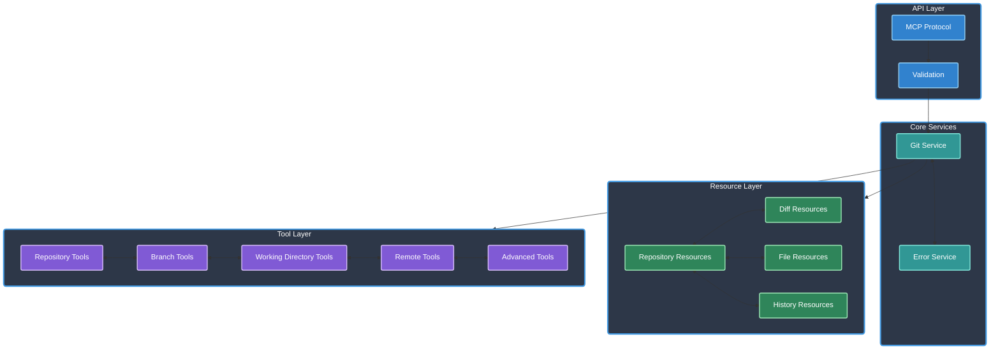

# GIT MCP Server

[](https://www.typescriptlang.org/)
[](https://modelcontextprotocol.io/)
[]()
[](https://opensource.org/licenses/Apache-2.0)
[]()
[](https://github.com/cyanheads/git-mcp-server)

A Model Context Protocol (MCP) server that provides tools for interacting with Git repositories. This server allows AI assistants and LLM agents to manage repositories, branches, commits, and files through a standardized interface without requiring direct filesystem or command-line access. It exposes Git operations as MCP resources and tools while maintaining proper security boundaries.

## Table of Contents

- [Overview](#overview)
  - [Architecture & Components](#architecture--components)
- [Features](#features)
  - [Resource Access](#resource-access)
  - [Git Operations](#git-operations)
- [Installation](#installation)
  - [Prerequisites](#prerequisites)
  - [Install from NPM](#install-from-npm)
  - [Install from Source](#install-from-source)
- [Usage](#usage)
  - [Running the Server](#running-the-server)
  - [Integration with Claude](#integration-with-claude)
  - [Integration with Other MCP Clients](#integration-with-other-mcp-clients)
- [Project Structure](#project-structure)
- [Tools](#tools)
  - [Repository Operations](#repository-operations)
  - [Branch Operations](#branch-operations)
  - [Working Directory Operations](#working-directory-operations)
  - [Remote Operations](#remote-operations)
  - [Advanced Operations](#advanced-operations)
- [Resources](#resources)
  - [Repository Resources](#repository-resources)
- [Development](#development)
  - [Build and Test](#build-and-test)
- [License](#license)

## Overview

Key capabilities:

- **Repository Management**: Initialize, clone, and check repository status
- **Branch Operations**: Create, list, checkout, delete, and merge branches
- **Working Directory**: Stage files, commit changes, create diffs
- **Remote Operations**: Add remotes, fetch, pull, push
- **Advanced Git Commands**: Manage tags, stash changes, cherry-pick, rebase

### Architecture & Components

Core system architecture:

<details>
<summary>Click to expand Mermaid diagram</summary>



</details>

Core Components:

- **MCP Server**: Uses the Model Context Protocol SDK to create a server that exposes resources and tools
- **Git Service**: Abstraction layer over simple-git to provide clean interfaces for Git operations
- **Resources**: Expose Git data through MCP resources with consistent URI templates
- **Tools**: Expose Git operations through MCP tools with well-defined schemas
- **Error Handling**: Standardized error handling and reporting

## Features

### Resource Access

Expose Git repository information through MCP resources:

- **Repository Information**: Access basic Git repository information including current branch, status, and reference details
- **Repository Branches**: List all branches in the repository with current branch indicator
- **Repository Remotes**: List all configured remote repositories with their URLs
- **Repository Tags**: List all tags in the repository with their references
- **File Content**: Access content of specific files at a given Git reference
- **Directory Listing**: View lists of files and directories at a specific path and reference
- **Diffs**: Get differences between references, unstaged changes, or staged changes
- **Commit History**: View detailed commit logs with author, date, and message information
- **File Blame**: See line-by-line attribution showing which commit last modified each line
- **Commit Details**: Access detailed information about specific commits including diff changes

### Git Operations

Execute Git commands through MCP tools:

- **Repository Operations**: Initialize repositories, clone from remotes, check repository status
- **Branch Operations**: Create branches, list branches, checkout, delete branches, merge
- **Working Directory Operations**: Stage files, unstage files, commit changes, create diffs
- **Remote Operations**: Add remotes, list remotes, fetch, pull, push
- **Advanced Operations**: Manage tags, stash changes, cherry-pick commits, rebase branches, reset, clean

## Installation

### Prerequisites

- Node.js 16 or higher
- Git installed and available in the PATH

### Install from NPM

```bash
npm install -g git-mcp-server
```

### Install from Source

```bash
git clone https://github.com/cyanheads/git-mcp-server.git
cd git-mcp-server
npm install
npm run build
```

## Usage

### Running the Server

```bash
git-mcp-server
```

The server communicates through stdin/stdout using the Model Context Protocol, making it compatible with any MCP client.

### Integration with Claude

Add to your Claude configuration file:

```json
{
  "mcpServers": {
    "git": {
      "command": "git-mcp-server",
      "args": [],
      "env": {},
      "disabled": false
    }
  }
}
```

### Integration with Other MCP Clients

Use the MCP inspector to test the server:

```bash
npx @modelcontextprotocol/inspector git-mcp-server
```

## Project Structure

The codebase follows a modular structure:

```
git-mcp-server/
├── src/
│   ├── index.ts           # Entry point
│   ├── server.ts          # MCP server implementation
│   ├── resources/         # Resource implementations
│   │   ├── descriptors.ts # Resource URI templates
│   │   ├── diff.ts        # Diff-related resources
│   │   ├── file.ts        # File-related resources
│   │   ├── history.ts     # History-related resources
│   │   ├── index.ts       # Resource registration
│   │   └── repository.ts  # Repository resources
│   ├── services/          # Service implementations
│   │   ├── error-service.ts # Error handling
│   │   └── git-service.ts   # Git operations abstraction
│   ├── tools/             # Tool implementations
│   │   ├── advanced.ts    # Advanced Git operations
│   │   ├── branch.ts      # Branch operations
│   │   ├── index.ts       # Tool registration
│   │   ├── remote.ts      # Remote operations
│   │   ├── repository.ts  # Repository operations
│   │   └── workdir.ts     # Working directory operations
│   ├── types/             # Type definitions
│   │   └── git.ts         # Git-related types
│   └── utils/             # Utility functions
│       └── validation.ts  # Input validation
└── scripts/               # Development scripts
```

## Tools

Git MCP Server provides a comprehensive suite of tools for Git operations:

### Repository Operations

| Tool         | Description                                                                                      |
| ------------ | ------------------------------------------------------------------------------------------------ |
| `git_init`   | Initialize a new Git repository at the specified path with options for bare repositories.        |
| `git_clone`  | Clone a Git repository from a remote URL to a local path with branch and depth options.          |
| `git_status` | Get the current status of a Git repository including working directory and staging area changes. |

### Branch Operations

| Tool                | Description                                                                                    |
| ------------------- | ---------------------------------------------------------------------------------------------- |
| `git_branch_list`   | List all branches in a repository with options to include remote branches.                     |
| `git_branch_create` | Create a new branch with options for specifying the starting point and automatic checkout.     |
| `git_checkout`      | Checkout a branch, tag, or commit with options to create a new branch during checkout.         |
| `git_branch_delete` | Delete a branch with options for force deletion of unmerged branches.                          |
| `git_merge`         | Merge a branch into the current branch with customizable commit messages and merge strategies. |

### Working Directory Operations

| Tool                | Description                                                                                     |
| ------------------- | ----------------------------------------------------------------------------------------------- |
| `git_add`           | Stage files for commit with support for individual files or entire directories.                 |
| `git_reset`         | Unstage files from the staging area with options for specific files or all staged changes.      |
| `git_commit`        | Commit staged changes with customizable commit messages, author information, and amend options. |
| `git_diff_unstaged` | Get a diff of all unstaged changes in the working directory with options for specific files.    |
| `git_diff_staged`   | Get a diff of all staged changes in the index with options for specific files.                  |
| `git_reset_commit`  | Reset the repository to a specific reference with options for hard, soft, or mixed mode.        |
| `git_clean`         | Remove untracked files from the working tree with options for directories and force cleaning.   |

### Remote Operations

| Tool              | Description                                                                                  |
| ----------------- | -------------------------------------------------------------------------------------------- |
| `git_remote_add`  | Add a new remote repository with a name and URL.                                             |
| `git_remote_list` | List all configured remote repositories and their URLs.                                      |
| `git_fetch`       | Fetch updates from a remote repository with options for specific branches.                   |
| `git_pull`        | Pull changes from a remote repository with options for rebase strategy.                      |
| `git_push`        | Push local changes to a remote repository with options for force push and upstream tracking. |

### Advanced Operations

| Tool               | Description                                                                               |
| ------------------ | ----------------------------------------------------------------------------------------- |
| `git_tag_create`   | Create a new tag with options for annotated tags with messages.                           |
| `git_tag_list`     | List all tags in the repository with their references.                                    |
| `git_stash_create` | Stash changes in the working directory with options for untracked files and descriptions. |
| `git_stash_list`   | List all stashes in the repository with their descriptions.                               |
| `git_stash_apply`  | Apply a stashed change without removing it from the stash list.                           |
| `git_stash_pop`    | Apply a stashed change and remove it from the stash list.                                 |
| `git_cherry_pick`  | Apply changes from specific commits to the current branch.                                |
| `git_rebase`       | Rebase the current branch onto another branch with interactive mode options.              |
| `git_log`          | Get commit history with customizable output format and depth.                             |
| `git_show`         | Show detailed information about a specific commit including diff changes.                 |

## Resources

Git MCP Server exposes Git data through standard MCP resources:

### Repository Resources

| Resource                                                    | Description                                                                              |
| ----------------------------------------------------------- | ---------------------------------------------------------------------------------------- |
| `git://repo/{repoPath}/info`                                | Basic Git repository information including current branch, status, and reference details |
| `git://repo/{repoPath}/branches`                            | List of all branches in the repository with current branch indicator                     |
| `git://repo/{repoPath}/remotes`                             | List of all configured remote repositories with their URLs                               |
| `git://repo/{repoPath}/tags`                                | List of all tags in the repository with their references                                 |
| `git://repo/{repoPath}/file/{filePath}?ref={ref}`           | Returns the content of a specific file at a given Git reference                          |
| `git://repo/{repoPath}/ls/{dirPath}?ref={ref}`              | Returns a list of files and directories at a specific path and reference                 |
| `git://repo/{repoPath}/diff/{fromRef}/{toRef}?path={path}`  | Returns a diff between two Git references (commits, branches, tags)                      |
| `git://repo/{repoPath}/diff-unstaged?path={path}`           | Returns a diff of all unstaged changes in the working directory                          |
| `git://repo/{repoPath}/diff-staged?path={path}`             | Returns a diff of all staged changes in the index                                        |
| `git://repo/{repoPath}/log?maxCount={maxCount}&file={file}` | Returns the commit history log with author, date, and message details                    |
| `git://repo/{repoPath}/blame/{filePath}`                    | Returns line-by-line attribution showing which commit last modified each line            |
| `git://repo/{repoPath}/commit/{commitHash}`                 | Returns detailed information about a specific commit including diff changes              |

## Development

### Build and Test

```bash
# Build the project
npm run build

# Watch for changes
npm run watch

# Test with MCP inspector
npm run inspector

# Clean build artifacts
npm run clean

# Rebuild completely
npm run rebuild
```

## License

Apache License 2.0 - See [LICENSE](LICENSE) for details.

---

<div align="center">
Built with the Model Context Protocol
</div>
