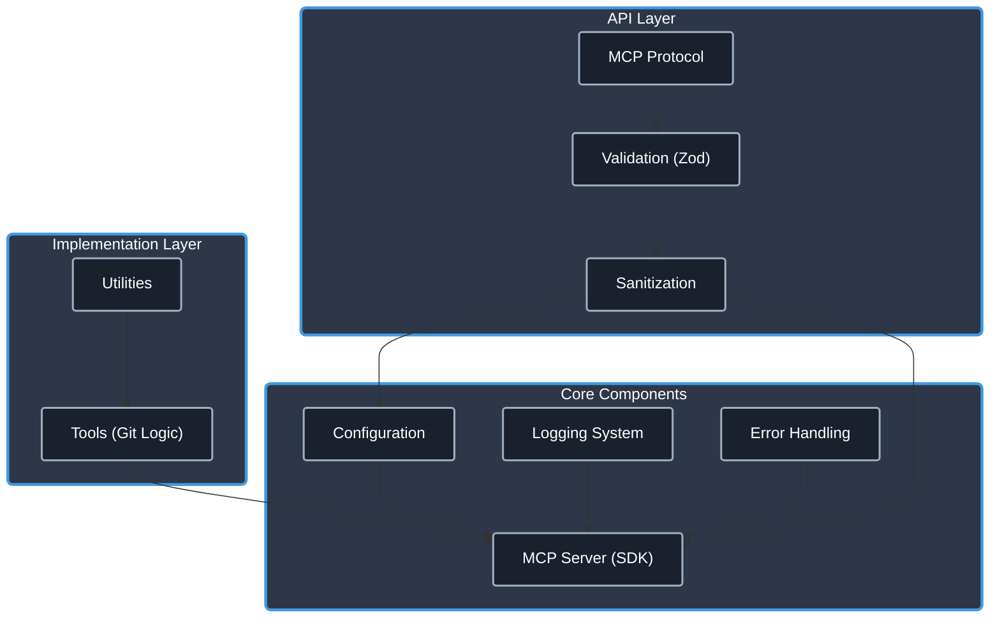

# Git MCP Server (TypeScript Template Based)

[](https://www.typescriptlang.org/)
[](https://modelcontextprotocol.io/)
[](./CHANGELOG.md)
[](https://opensource.org/licenses/Apache-2.0)
[](https://github.com/cyanheads/git-mcp-server/issues)
[](https://github.com/cyanheads/git-mcp-server)

A [Model Context Protocol (MCP)](https://modelcontextprotocol.io/) server built with TypeScript, providing tools to interact with Git repositories. This server allows MCP-compatible clients (like LLM agents or IDE extensions) to perform Git operations programmatically.

This server is based on the [`cyanheads/mcp-ts-template`](https://github.com/cyanheads/mcp-ts-template) and provides a foundation for building robust MCP servers with a focus on Git integration.

> **.clinerules**: This repository includes a [.clinerules](.clinerules) file that serves as a developer cheat sheet for your LLM coding agent with quick reference for the codebase patterns, file locations, and code snippets. Remember to keep it updated as the server evolves.

## Table of Contents

- [Overview](#overview)
  - [Architecture & Components](#architecture--components)
- [Features](#features)
  - [Core Utilities (from Template)](#core-utilities-from-template)
  - [Git Operations (Tools)](#git-operations-tools)
- [Installation](#installation)
  - [Prerequisites](#prerequisites)
  - [Install from Source](#install-from-source)
- [Usage](#usage)
  - [Running the Server](#running-the-server)
  - [Configuration (Environment Variables)](#configuration-environment-variables)
  - [Integration with MCP Clients](#integration-with-mcp-clients)
- [Project Structure](#project-structure)
- [Tools](#tools)
- [Resources](#resources)
- [Development](#development)
  - [Build and Test](#build-and-test)
  - [Adding a New Tool](#adding-a-new-tool)
- [License](#license)

## Overview

This server enables AI assistants and other MCP clients to interact with local Git repositories. It exposes specific Git commands as MCP tools, allowing for programmatic control over repository status checking, branching, staging, and committing.

Key capabilities provided by the current implementation:

- **Repository Status**: Check the current status of a repository.
- **Branch Listing**: List local and remote branches.
- **Staging**: Add files to the Git index.
- **Committing**: Create new commits with messages.
- **Working Directory Management**: Set and clear a session-specific working directory for Git operations.

### Architecture & Components

The server follows the modular architecture provided by the `mcp-ts-template`:

<details>
<summary>Click to expand architecture diagram</summary>



</details>

Core Components:

- **MCP Server (`src/mcp-server/server.ts`)**: Uses the `@modelcontextprotocol/sdk` to create the server, handle transports (stdio/http), manage sessions (http), and register tools.
- **Configuration (`src/config/index.ts`)**: Loads environment variables and package information.
- **Tools (`src/mcp-server/tools/`)**: Implementations of specific Git commands exposed as MCP tools. Each tool typically includes:
    - `logic.ts`: Core command execution (using `child_process`) and result parsing.
    - `registration.ts`: Tool definition (name, description, Zod schema) and registration with the MCP server instance.
    - `index.ts`: Exports the registration function.
- **Utilities (`src/utils/`)**: Reusable modules for logging, error handling, request context, ID generation, sanitization, etc., inherited from the template.
- **Global Types (`src/types-global/`)**: Shared TypeScript definitions.
- **Entry Point (`src/index.ts`)**: Initializes the server based on configuration and handles graceful shutdown.

## Features

### Core Utilities (from Template)

Leverages the robust utilities provided by the `mcp-ts-template`:

- **Logging**: Structured, configurable logging (file rotation, console, MCP notifications) with sensitive data redaction.
- **Error Handling**: Centralized error processing, standardized error types (`McpError`), and automatic logging.
- **Configuration**: Environment variable loading (`dotenv`).
- **Input Validation/Sanitization**: Uses `zod` for schema validation and custom sanitization logic (crucial for paths).
- **Request Context**: Tracking and correlation of operations via unique request IDs.
- **Type Safety**: Strong typing enforced by TypeScript and Zod schemas.
- **HTTP Transport Option**: Built-in Express server with SSE, session management, and CORS support.

### Git Operations (Tools)

Exposes core Git functionalities as MCP tools:

- Check repository status (`git_status`).
- List branches (`git_branch_list`).
- Stage files (`git_add`).
- Commit changes (`git_commit`).
- Set/clear session working directory (`git_set_working_dir`, `git_clear_working_dir`).
- Fetch changes from a remote (`git_fetch`).
- Pull changes from a remote (`git_pull`).
- Push changes to a remote (`git_push`).
- Checkout branches or commits (`git_checkout`).
- View commit history (`git_log`).
- Show changes between commits/working tree (`git_diff`).
- Reset current HEAD (`git_reset`).

## Installation

### Prerequisites

- [Node.js (v18+)](https://nodejs.org/)
- [npm](https://www.npmjs.com/) (comes with Node.js)
- [Git](https://git-scm.com/) installed and accessible in the system PATH.

### Install from Source

1.  Clone the repository:
    ```bash
    git clone https://github.com/cyanheads/git-mcp-server.git
    cd git-mcp-server
    ```
2.  Install dependencies:
    ```bash
    npm install
    ```
3.  Build the project:
    ```bash
    npm run build
    ```
    This compiles the TypeScript code to JavaScript in the `build/` directory and makes the entry point executable.

## Usage

### Running the Server

Execute the compiled entry point:

```bash
node build/index.js
```

By default, the server uses the `stdio` transport. To use the HTTP transport:

```bash
MCP_TRANSPORT_TYPE=http node build/index.js
```

Refer to the Configuration section for customizing ports, hosts, and logging.

### Configuration (Environment Variables)

Configure the server using environment variables. Create a `.env` file in the project root (copy from `.env.example`) or set them in your environment.

| Variable               | Description                                                                                                   | Default             |
| ---------------------- | ------------------------------------------------------------------------------------------------------------- | ------------------- |
| `MCP_TRANSPORT_TYPE`   | Transport mechanism: `stdio` or `http`.                                                                       | `stdio`             |
| `MCP_HTTP_PORT`        | Port for the HTTP server (if `MCP_TRANSPORT_TYPE=http`). Retries next ports if busy.                          | `3000`              |
| `MCP_HTTP_HOST`        | Host address for the HTTP server (if `MCP_TRANSPORT_TYPE=http`).                                              | `127.0.0.1`         |
| `MCP_ALLOWED_ORIGINS`  | Comma-separated list of allowed origins for CORS (if `MCP_TRANSPORT_TYPE=http`).                              | (none)              |
| `MCP_SERVER_NAME`      | Name reported during MCP initialization.                                                                      | `git-mcp-server`    |
| `MCP_SERVER_VERSION`   | Version reported during MCP initialization.                                                                   | (from package.json) |
| `LOG_LEVEL`            | Logging level (`debug`, `info`, `notice`, `warning`, `error`, `crit`, `alert`, `emerg`).                        | `info`              |
| `LOG_REDACT_PATTERNS`  | Comma-separated regex patterns for redacting sensitive data in logs.                                          | (predefined)        |
| `LOG_FILE_PATH`        | Path for log file output. If unset, logs only to console.                                                     | (none)              |
| `LOG_MAX_FILE_SIZE_MB` | Max size (MB) for log file rotation.                                                                          | `10`                |
| `LOG_MAX_FILES`        | Max number of rotated log files to keep.                                                                      | `5`                 |
| `LOG_ZIP_ARCHIVES`     | Compress rotated log files (`true`/`false`).                                                                  | `true`              |

### Integration with MCP Clients

Configure your MCP client (e.g., Claude Desktop, VS Code Extension) to run this server.

Example `cline_mcp_settings.json` entry:

```json
{
  "mcpServers": {
    "git": {
      "command": "node", // Use node to run the script
      "args": ["/path/to/your/git-mcp-server/build/index.js"], // Absolute path to the built entry point
      "env": {
        // "MCP_TRANSPORT_TYPE": "http", // Optional: if using http
        // "MCP_HTTP_PORT": "3001"      // Optional: if using http and non-default port
      },
      "disabled": false,
      "autoApprove": [] // Configure auto-approval rules if desired
    }
  }
}
```

Use the MCP inspector tool for testing:

```bash
# Test stdio transport
npx @modelcontextprotocol/inspector build/index.js

# Test http transport (make sure server is running with MCP_TRANSPORT_TYPE=http)
# npx @modelcontextprotocol/inspector --transport http --port 3000 # Adjust port if needed
```

## Project Structure

The codebase follows a modular structure within the `src/` directory:

```
git-mcp-server/
├── src/
│   ├── index.ts           # Entry point: Initializes and starts the server
│   ├── config/            # Configuration loading (env vars, package info)
│   │   └── index.ts
│   ├── mcp-server/        # Core MCP server logic and capability registration
│   │   ├── server.ts      # Server setup, transport handling, tool registration
│   │   ├── resources/     # MCP Resource implementations (currently none)
│   │   └── tools/         # MCP Tool implementations (subdirs per tool)
│   ├── types-global/      # Shared TypeScript type definitions
│   └── utils/             # Common utility functions (logger, error handler, etc.)
```

For a detailed file tree, run `npm run tree`.

## Tools

The following Git operations are currently implemented as MCP tools:

| Tool                    | Description                                                                                                                      | Input Schema Keys          | Output (JSON) Keys                                                                 |
| ----------------------- | -------------------------------------------------------------------------------------------------------------------------------- | -------------------------- | ---------------------------------------------------------------------------------- |
| `git_status`            | Gets repository status (branch, staged, modified, untracked files).                                                              | `path?`                    | `currentBranch`, `staged`, `modified`, `untracked`, `conflicted`, `isClean`        |
| `git_branch_list`       | Lists local or all branches, indicating the current one.                                                                         | `path?`, `all?`            | `currentBranch`, `branches`                                                        |
| `git_add`               | Stages specified files or patterns. Defaults to staging all changes (`.`).                                                       | `path?`, `files?`          | `success`, `statusMessage`, `filesStaged`                                          |
| `git_commit`            | Commits staged changes with a message. Supports author override, amend, allow-empty.                                             | `path?`, `message`, `author?`, `allowEmpty?`, `amend?` | `success`, `statusMessage`, `commitHash?`, `nothingToCommit?` |
| `git_set_working_dir`   | Sets the default working directory for the current session. Requires absolute path. Validates if path is Git repo by default. | `path`, `validateGitRepo?` | `success`, `statusMessage`, `workingDirectory`                                     |
| `git_clear_working_dir` | Clears the session-specific working directory set by `git_set_working_dir`.                                                  | (none)                     | `success`, `statusMessage`                                                         |
| `git_fetch`             | Downloads objects and refs from other repositories.                                                                          | `path?`, `remote?`, `prune?`, `tags?`, `all?` | `success`, `statusMessage`, `fetchResult?`                                         |
| `git_pull`              | Fetches from and integrates with another repository or local branch.                                                         | `path?`, `remote?`, `branch?`, `rebase?`, `ffOnly?` | `success`, `statusMessage`, `filesChanged?`                                        |
| `git_push`              | Updates remote refs using local refs. Supports tags, force, upstream setting, delete.                                        | `path?`, `remote?`, `branch?`, `remoteBranch?`, `force?`, `forceWithLease?`, `setUpstream?`, `tags?`, `delete?` | `success`, `statusMessage`, `remoteMessages?`                                      |
| `git_checkout`          | Switches branches or restores working tree files. Supports creating new branches.                                            | `path?`, `branchOrPath`, `newBranch?`, `force?` | `success`, `statusMessage`, `branchSwitched?`, `filesRestored?`                    |
| `git_log`               | Shows commit logs. Supports filtering by count, author, date, branch/file.                                                   | `path?`, `maxCount?`, `author?`, `since?`, `until?`, `branchOrFile?` | `commits` (array of commit objects)                                                |
| `git_diff`              | Shows changes between commits, commit and working tree, etc. Can show staged changes or diff specific files.                 | `path?`, `commit1?`, `commit2?`, `staged?`, `file?` | `diff` (string output)                                                             |
| `git_reset`             | Resets current HEAD to a specified state. Supports soft, mixed, hard modes. USE 'hard' WITH CAUTION.                         | `path?`, `mode?`, `commit?` | `success`, `statusMessage`                                                         |

*Note: The `path` parameter for most tools defaults to the session's working directory if set via `git_set_working_dir`, otherwise it defaults to the server's CWD.*

## Resources

This server does not currently implement any MCP resources. Future versions may add resources for accessing file content, commit history, etc.

## Development

### Build and Test

```bash
# Build the project (compile TS to JS in build/)
npm run build

# Watch for changes and rebuild automatically
npm run watch

# Test the server locally using the MCP inspector tool (stdio)
npm run inspector

# Clean build artifacts
npm run clean

# Generate a file tree representation for documentation (docs/tree.md)
npm run tree

# Clean and rebuild the project completely
npm run rebuild
```

### Adding a New Tool

Follow the pattern established in `src/mcp-server/tools/`:

1.  **Create Directory**: `src/mcp-server/tools/yourNewGitTool/`.
2.  **Define Logic & Schema (`logic.ts`)**:
    - Define a Zod schema for the tool's input (`YourToolInputSchema`).
    - Infer the TypeScript input type (`YourToolInput = z.infer<typeof YourToolInputSchema>`).
    - Define a TypeScript interface for the structured output (`YourToolResult`).
    - Implement the core logic function (`async function yourToolLogic(input: YourToolInput, context: RequestContext): Promise<YourToolResult>`). Use `child_process.exec` or similar to run the `git` command. **Crucially, sanitize path inputs using `sanitization.sanitizePath()`**. Parse the command output into the `YourToolResult` structure. Throw `McpError` for expected errors (e.g., validation, Git errors). Wrap the core logic with `ErrorHandler.tryCatch`.
3.  **Implement Registration (`registration.ts`)**:
    - Import necessary types, schemas, logic function, `McpServer`, `ErrorHandler`, `logger`.
    - Define constants for `TOOL_NAME` and `TOOL_DESCRIPTION`.
    - Create `async function registerYourNewTool(server: McpServer)`.
    - Inside, call `server.tool(TOOL_NAME, TOOL_DESCRIPTION, YourToolInputSchema.shape, async (validatedArgs, operationContext) => { ... })`.
    - The handler should:
        - Call your `yourToolLogic` function with `validatedArgs` and `operationContext`.
        - Wrap the successful `YourToolResult` in `TextContent` (usually `JSON.stringify`).
        - Return a `CallToolResult` object: `{ content: [textContent] }`.
        - The `server.tool` wrapper handles basic error catching, but your logic should throw specific `McpError`s. The handler might need to format errors into the `CallToolResult` if not automatically handled by the SDK wrapper.
4.  **Export Registration (`index.ts`)**: `export { registerYourNewTool } from './registration.js';`
5.  **Register in Server (`src/mcp-server/server.ts`)**: Import `registerYourNewTool` and call it within the `registerTools` function.

## License

This project is licensed under the Apache License 2.0 - see the [LICENSE](LICENSE) file for details.

---

<div align="center">
Built with the <a href="https://modelcontextprotocol.io/">Model Context Protocol</a>
</div>
