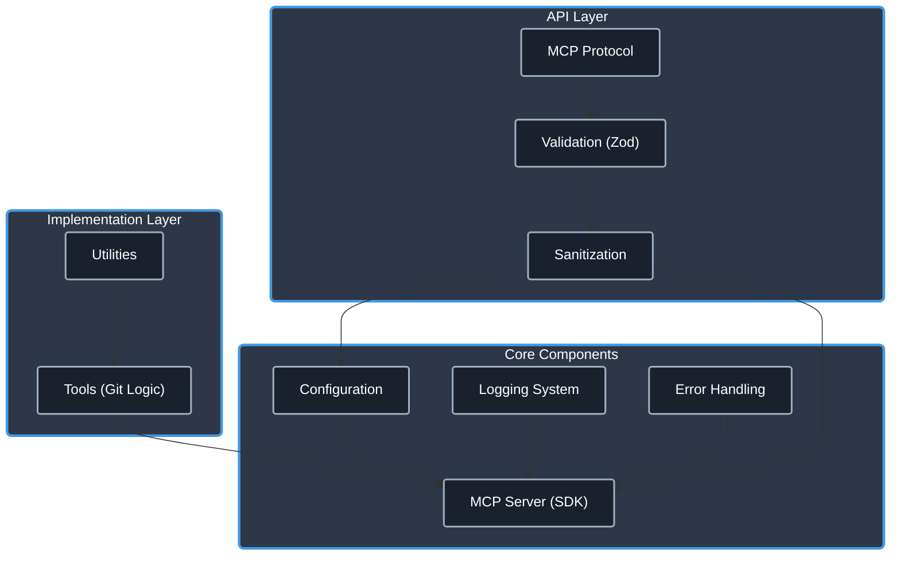

# Git MCP Server

[](https://www.typescriptlang.org/)
[](https://modelcontextprotocol.io/)
[](./CHANGELOG.md)
[](https://opensource.org/licenses/Apache-2.0)
[](https://github.com/cyanheads/git-mcp-server/issues)
[](https://github.com/cyanheads/git-mcp-server)

An MCP (Model Context Protocol) server providing tools to interact with Git repositories. Enables LLMs and AI agents to perform Git operations like clone, commit, push, pull, branch, diff, log, status, and more via the MCP standard.

Built on the [`cyanheads/mcp-ts-template`](https://github.com/cyanheads/mcp-ts-template), this server follows a modular architecture:

> **Note:** This version (v2.0.0) focuses on refactoring and updating the core Git tools based on the latest MCP SDK. MCP Resource capabilities are not implemented in this version. For resource access, please use [v1.2.4](https://github.com/cyanheads/git-mcp-server/releases/tag/v1.2.4).



Implemented as an MCP server, it allows LLM agents and other compatible clients to interact with local Git repositories using standardized commands.

> **Developer Note**: This repository includes a [.clinerules](.clinerules) file that serves as a developer cheat sheet for your LLM coding agent with quick reference for the codebase patterns, file locations, and code snippets.

## Table of Contents

- [Overview](#overview)
- [Features](#features)
- [Installation](#installation)
- [Configuration](#configuration)
- [Project Structure](#project-structure)
- [Tools](#tools)
- [Resources](#resources)
- [Development](#development)
- [License](#license)

## Overview

The Git MCP Server implements the Model Context Protocol (MCP), enabling standardized communication between LLMs and external systems through:

- **Clients**: Claude Desktop, IDEs, and other MCP-compatible clients.
- **Servers**: This server provides tools for Git operations.
- **LLM Agents**: AI models that leverage the server's Git capabilities.

This server enables AI assistants and other MCP clients to interact with local Git repositories. It exposes specific Git commands as MCP tools, allowing for programmatic control over repository status checking, branching, staging, committing, fetching, pulling, pushing, and more.

## Features

### Core Utilities (from Template)

Leverages the robust utilities provided by the `mcp-ts-template`:

- **Logging**: Structured, configurable logging (file rotation, console, MCP notifications) with sensitive data redaction.
- **Error Handling**: Centralized error processing, standardized error types (`McpError`), and automatic logging.
- **Configuration**: Environment variable loading (`dotenv`).
- **Input Validation/Sanitization**: Uses `zod` for schema validation and custom sanitization logic (crucial for paths).
- **Request Context**: Tracking and correlation of operations via unique request IDs.
- **Type Safety**: Strong typing enforced by TypeScript and Zod schemas.
- **HTTP Transport Option**: Built-in Express server with SSE, session management, and CORS support.

### Git Operations

- **Comprehensive Command Coverage**: Exposes a wide range of Git commands as MCP tools (see [Tools](#tools) section).
- **Repository Interaction**: Supports status checking, branching, staging, committing, fetching, pulling, pushing, diffing, logging, resetting, tagging, and more.
- **Working Directory Management**: Allows setting and clearing a session-specific working directory for context persistence across multiple Git operations.
- **Safety Features**: Includes checks and requires explicit confirmation for potentially destructive operations like `git clean` and `git reset --hard`.

## Installation

### Prerequisites

- [Node.js (v18+)](https://nodejs.org/)
- [npm](https://www.npmjs.com/) (comes with Node.js)
- [Git](https://git-scm.com/) installed and accessible in the system PATH.

### Install from Source

1.  Clone the repository:
    ```bash
    git clone https://github.com/cyanheads/git-mcp-server.git
    cd git-mcp-server
    ```
2.  Install dependencies:
    ```bash
    npm install
    ```
3.  Build the project:
    ```bash
    npm run build
    ```
    This compiles the TypeScript code to JavaScript in the `build/` directory and makes the entry point executable.

## Configuration

### Environment Variables

Configure the server using environment variables. Create a `.env` file in the project root (copy from `.env.example`) or set them in your environment.

| Variable               | Description                                                                              | Default             |
| ---------------------- | ---------------------------------------------------------------------------------------- | ------------------- |
| `MCP_TRANSPORT_TYPE`   | Transport mechanism: `stdio` or `http`.                                                  | `stdio`             |
| `MCP_HTTP_PORT`        | Port for the HTTP server (if `MCP_TRANSPORT_TYPE=http`). Retries next ports if busy.     | `3000`              |
| `MCP_HTTP_HOST`        | Host address for the HTTP server (if `MCP_TRANSPORT_TYPE=http`).                         | `127.0.0.1`         |
| `MCP_ALLOWED_ORIGINS`  | Comma-separated list of allowed origins for CORS (if `MCP_TRANSPORT_TYPE=http`).         | (none)              |
| `MCP_SERVER_NAME`      | Name reported during MCP initialization.                                                 | `git-mcp-server`    |
| `MCP_SERVER_VERSION`   | Version reported during MCP initialization.                                              | (from package.json) |
| `LOG_LEVEL`            | Logging level (`debug`, `info`, `notice`, `warning`, `error`, `crit`, `alert`, `emerg`). | `info`              |
| `LOG_REDACT_PATTERNS`  | Comma-separated regex patterns for redacting sensitive data in logs.                     | (predefined)        |
| `LOG_FILE_PATH`        | Path for log file output. If unset, logs only to console.                                | (none)              |
| `LOG_MAX_FILE_SIZE_MB` | Max size (MB) for log file rotation.                                                     | `10`                |
| `LOG_MAX_FILES`        | Max number of rotated log files to keep.                                                 | `5`                 |
| `LOG_ZIP_ARCHIVES`     | Compress rotated log files (`true`/`false`).                                             | `true`              |

### MCP Client Settings

Add to your MCP client settings (e.g., `cline_mcp_settings.json`):

```json
{
  "mcpServers": {
    "git": {
      "command": "node", // Use node to run the script
      "args": ["/path/to/your/git-mcp-server/build/index.js"], // Absolute path to the built entry point
      "env": {
        // "MCP_TRANSPORT_TYPE": "http", // Optional: if using http
        // "MCP_HTTP_PORT": "3001"      // Optional: if using http and non-default port
      },
      "disabled": false,
      "autoApprove": [] // Configure auto-approval rules if desired
    }
  }
}
```

## Project Structure

The codebase follows a modular structure within the `src/` directory:

```
src/
├── index.ts           # Entry point: Initializes and starts the server
├── config/            # Configuration loading (env vars, package info)
│   └── index.ts
├── mcp-server/        # Core MCP server logic and capability registration
│   ├── server.ts      # Server setup, transport handling, tool registration
│   ├── resources/     # MCP Resource implementations (currently none)
│   └── tools/         # MCP Tool implementations (subdirs per tool)
├── types-global/      # Shared TypeScript type definitions
└── utils/             # Common utility functions (logger, error handler, etc.)
```

For a detailed file tree, run `npm run tree` or see [docs/tree.md](docs/tree.md).

## Tools

The Git MCP Server provides a suite of tools for interacting with Git repositories, callable via the Model Context Protocol.

| Tool Name               | Description                                                                                              | Key Arguments                                                                                                   |
| :---------------------- | :------------------------------------------------------------------------------------------------------- | :-------------------------------------------------------------------------------------------------------------- |
| `git_add`               | Stages specified files or patterns.                                                                      | `path?`, `files?`                                                                                               |
| `git_branch`            | Manages branches (list, create, delete, rename, show current).                                           | `path?`, `mode`, `branchName?`, `newBranchName?`, `startPoint?`, `force?`, `all?`, `remote?`                    |
| `git_checkout`          | Switches branches or restores working tree files.                                                        | `path?`, `branchOrPath`, `newBranch?`, `force?`                                                                 |
| `git_cherry_pick`       | Applies changes introduced by existing commits.                                                          | `path?`, `commitRef`, `mainline?`, `strategy?`, `noCommit?`, `signoff?`                                         |
| `git_clean`             | Removes untracked files. **Requires `force: true`**.                                                     | `path?`, `force`, `dryRun?`, `directories?`, `ignored?`                                                         |
| `git_clear_working_dir` | Clears the session-specific working directory.                                                           | (none)                                                                                                          |
| `git_clone`             | Clones a repository into a specified absolute path.                                                      | `repositoryUrl`, `targetPath`, `branch?`, `depth?`, `quiet?`                                                    |
| `git_commit`            | Commits staged changes with a message.                                                                   | `path?`, `message`, `author?`, `allowEmpty?`, `amend?`                                                          |
| `git_diff`              | Shows changes between commits, working tree, etc.                                                        | `path?`, `commit1?`, `commit2?`, `staged?`, `file?`                                                             |
| `git_fetch`             | Downloads objects and refs from other repositories.                                                      | `path?`, `remote?`, `prune?`, `tags?`, `all?`                                                                   |
| `git_init`              | Initializes a new Git repository at the specified absolute path.                                         | `path`, `initialBranch?`, `bare?`, `quiet?`                                                                     |
| `git_log`               | Shows commit logs.                                                                                       | `path?`, `maxCount?`, `author?`, `since?`, `until?`, `branchOrFile?`                                            |
| `git_merge`             | Merges the specified branch into the current branch.                                                     | `path?`, `branch`, `commitMessage?`, `noFf?`, `squash?`, `abort?`                                               |
| `git_pull`              | Fetches from and integrates with another repository or local branch.                                     | `path?`, `remote?`, `branch?`, `rebase?`, `ffOnly?`                                                             |
| `git_push`              | Updates remote refs using local refs.                                                                    | `path?`, `remote?`, `branch?`, `remoteBranch?`, `force?`, `forceWithLease?`, `setUpstream?`, `tags?`, `delete?` |
| `git_rebase`            | Reapplies commits on top of another base tip.                                                            | `path?`, `mode?`, `upstream?`, `branch?`, `interactive?`, `strategy?`, `strategyOption?`, `onto?`               |
| `git_remote`            | Manages remote repositories (list, add, remove, show).                                                   | `path?`, `mode`, `name?`, `url?`                                                                                |
| `git_reset`             | Resets current HEAD to a specified state. Supports soft, mixed, hard modes. **USE 'hard' WITH CAUTION**. | `path?`, `mode?`, `commit?`                                                                                     |
| `git_set_working_dir`   | Sets the default working directory for the current session. Requires absolute path.                      | `path`, `validateGitRepo?`                                                                                      |
| `git_show`              | Shows information about Git objects (commits, tags, etc.).                                               | `path?`, `ref`, `filePath?`                                                                                     |
| `git_stash`             | Manages stashed changes (list, apply, pop, drop, save).                                                  | `path?`, `mode`, `stashRef?`, `message?`                                                                        |
| `git_status`            | Gets repository status (branch, staged, modified, untracked files).                                      | `path?`                                                                                                         |
| `git_tag`               | Manages tags (list, create annotated/lightweight, delete).                                               | `path?`, `mode`, `tagName?`, `message?`, `commitRef?`, `annotate?`                                              |

_Note: The `path` parameter for most tools defaults to the session's working directory if set via `git_set_working_dir`, otherwise it defaults to the server's CWD._

## Resources

**MCP Resources are not implemented in this version (v2.0.0).**

This version focuses on the refactored Git tools implementation based on the latest `mcp-ts-template` and MCP SDK v1.10.2. Resource capabilities, previously available, have been temporarily removed during this major update.

If you require MCP Resource access (e.g., for reading file content directly via the server), please use the stable **[v1.2.4 release](https://github.com/cyanheads/git-mcp-server/releases/tag/v1.2.4)**.

Future development may reintroduce resource capabilities in a subsequent release.

## Development

### Build and Test

```bash
# Build the project (compile TS to JS in build/ and make executable)
npm run build

# Watch for changes and recompile automatically
npm run watch

# Test the server locally using the MCP inspector tool (stdio transport)
npm run inspector

# Clean build artifacts (runs scripts/clean.ts)
npm run clean

# Generate a file tree representation for documentation (runs scripts/tree.ts)
npm run tree

# Clean build artifacts and then rebuild the project
npm run rebuild
```

## License

This project is licensed under the Apache License 2.0 - see the [LICENSE](LICENSE) file for details.

---

<div align="center">
Built with the <a href="https://modelcontextprotocol.io/">Model Context Protocol</a>
</div>
