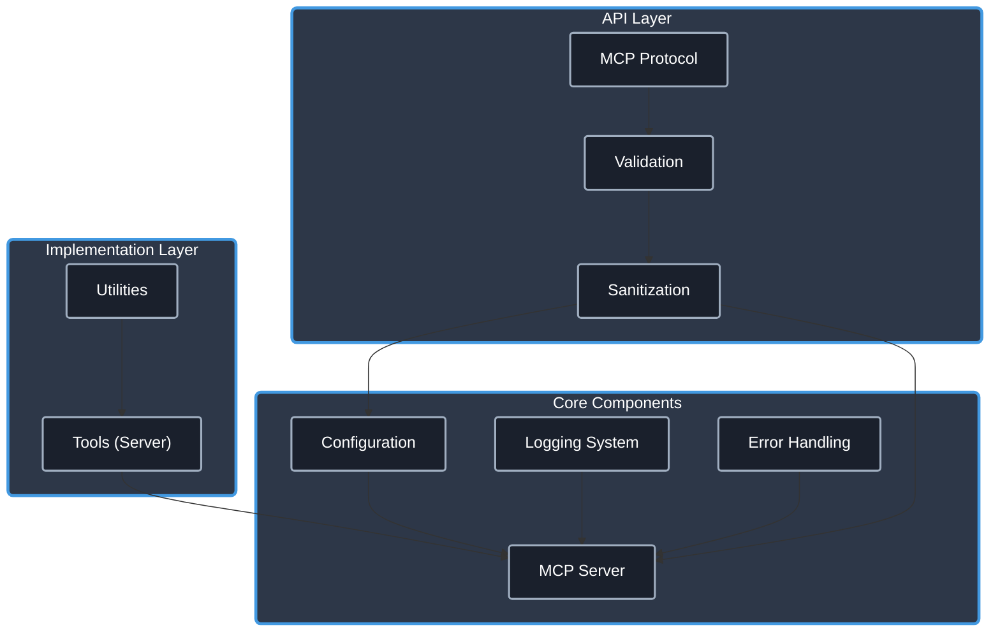

# Git MCP Server (TypeScript)

[](https://www.typescriptlang.org/)
[](https://modelcontextprotocol.io/)
[](./CHANGELOG.md) <!-- Link to Changelog -->
[](https://opensource.org/licenses/Apache-2.0)
[](https://github.com/cyanheads/git-mcp-server/issues) <!-- Update repo link if needed -->

A [Model Context Protocol (MCP)](https://modelcontextprotocol.io/) server built with TypeScript, providing tools to interact with Git repositories. This server allows MCP-compatible clients (like LLM agents or IDE extensions) to perform Git operations programmatically.

This project started from the `mcp-ts-template` and has been adapted to focus solely on providing Git functionalities as an MCP server.

## Using this server will get you:

- **Git Tools**: MCP tools for common Git operations (`git status`, `git branch`, `git add`, `git commit`).
- **Utilities**: A set of reusable utilities for logging, error handling, ID generation, rate limiting, and request context management inherited from the template.
- **Type Safety**: Strong typing with TypeScript.
- **Security**: Foundational security considerations (input sanitization).
- **Error Handling**: A robust error handling system.
- **JSON Responses**: Tools return structured JSON output for easier parsing by clients.

> **.clinerules**: This repository includes a [.clinerules](.clinerules) file that serves as a developer cheat sheet for your LLM coding agent with quick reference for the codebase patterns, file locations, and code snippets. Remember to keep it updated as the server evolves.

## Table of Contents

- [Overview](#overview)
  - [What is Model Context Protocol?](#what-is-model-context-protocol)
  - [Architecture & Components](#architecture--components)
- [Features](#features)
  - [Core Utilities](#core-utilities)
  - [Type Safety](#type-safety)
  - [Error Handling](#error-handling)
  - [Security](#security)
  - [Implemented Git Tools](#implemented-git-tools)
- [Installation](#installation)
- [Configuration](#configuration)
  - [Server Configuration](#server-configuration)
- [Project Structure](#project-structure)
- [Tool Documentation](#tool-documentation)
- [Development Guidelines](#development-guidelines)
  - [Adding a New Tool](#adding-a-new-tool)
- [Future Plans](#future-plans)
- [License](#license)

## Overview

### What is Model Context Protocol?

Model Context Protocol (MCP) is a framework that enables AI systems to interact with external tools and resources. It allows language models to execute **tools** that perform actions (like Git commands) and return results.

This server implements the MCP standard to expose Git operations as tools.

### Architecture & Components

The server follows a modular architecture designed for clarity and extensibility:

<details>
<summary>Click to expand architecture diagram</summary>



</details>

Core Components:

- **Configuration System**: Environment-aware configuration.
- **Logging System**: Structured logging with sensitive data redaction.
- **Error Handling**: Centralized error processing.
- **MCP Server**: Protocol implementation supporting both `stdio` and `http` transports.
- **HTTP Transport**: Express-based server using Server-Sent Events (SSE) for streaming, session management, and configurable CORS. Includes port conflict retry logic.
- **Validation Layer**: Input validation and sanitization using `validator`, `sanitize-html`, and `zod`.
- **Utilities**: Reusable utility functions.

## Features

### Core Utilities

- **Logging**: Configurable logging with file rotation and sensitive data redaction.
- **Error Handling**: Pattern-based error classification and standardized reporting.
- **ID Generation**: Secure unique identifier creation with prefix support.
- **Rate Limiting**: Request throttling to prevent API abuse.
- **Request Context**: Request tracking and correlation across operations.
- **Sanitization**: Input validation and cleaning using `validator` and `sanitize-html`.

### Type Safety

- **Global Types**: Shared type definitions for consistent interfaces.
- **Error Types**: Standardized error codes and structures.
- **MCP Protocol Types**: Type definitions for the MCP protocol (leveraging `@modelcontextprotocol/sdk`).
- **Tool Types**: Interfaces for tool registration and configuration.
- **Zod Schemas**: Used for robust validation of configuration files and tool inputs.

### Error Handling

- **Pattern-Based Classification**: Automatically categorize errors based on message patterns.
- **Consistent Formatting**: Standardized error responses with additional context.
- **Error Mapping**: Custom error transformation for domain-specific errors.
- **Safe Try/Catch Patterns**: Centralized error processing helpers (`ErrorHandler.tryCatch`).

### Security

- **Input Validation**: Using `validator` and `zod` for various data type checks.
- **Input Sanitization**: Using path normalization and basic checks to prevent command injection/path traversal.
- **Parameter Bounds**: Enforced limits within sanitization logic to prevent abuse.
- **Sensitive Data Redaction**: Automatic redaction in logs.

### Implemented Git Tools

- **[git_status](src/mcp-server/tools/gitStatus/)**: Gets repository status (branch, staged, modified, untracked files).
- **[git_branch_list](src/mcp-server/tools/gitBranchList/)**: Lists local or all branches.
- **[git_add](src/mcp-server/tools/gitAdd/)**: Stages specified files or patterns.
- **[git_commit](src/mcp-server/tools/gitCommit/)**: Commits staged changes with a message.
- **[git_set_working_dir](src/mcp-server/tools/gitSetWorkingDir/)**: Sets the default working directory for the session.
- **[git_clear_working_dir](src/mcp-server/tools/gitClearWorkingDir/)**: Clears the session-specific working directory.

## Installation

### Prerequisites

- [Node.js (v18+)](https://nodejs.org/)
- [npm](https://www.npmjs.com/) or [yarn](https://yarnpkg.com/)
- [Git](https://git-scm.com/) installed and accessible in the system PATH.

### Setup

1. Clone this repository:

   ```bash
   # Replace with your repo URL if different
   git clone https://github.com/cyanheads/git-mcp-server.git
   cd git-mcp-server
   ```

2. Install dependencies:

   ```bash
   npm install
   ```

3. Build the project:

   ```bash
   npm run build
   ```

## Configuration

### Server Configuration

#### Environment Variables

The **server** behavior can be configured using the following environment variables:

| Variable               | Description                                                                                                   | Default             |
| ---------------------- | ------------------------------------------------------------------------------------------------------------- | ------------------- |
| `MCP_TRANSPORT_TYPE`   | Specifies the transport mechanism for the **server**. Options: `stdio`, `http`.                               | `stdio`             |
| `MCP_HTTP_PORT`        | The port number for the HTTP **server** to listen on.                                                         | `3000`              |
| `MCP_HTTP_HOST`        | The host address for the HTTP **server** to bind to.                                                          | `127.0.0.1`         |
| `MCP_ALLOWED_ORIGINS`  | Comma-separated list of allowed origins for CORS requests when using the `http` transport for the **server**. | (none)              |
| `MCP_SERVER_NAME`      | Name of the MCP **server** (used in initialization).                                                          | `git-mcp-server`    | <!-- Updated Default -->
| `MCP_SERVER_VERSION`   | Version of the MCP **server** (used in initialization).                                                       | (from package.json) |
| `LOG_LEVEL`            | Logging level (e.g., `info`, `debug`, `warn`, `error`).                                                       | `info`              |
| `LOG_REDACT_PATTERNS`  | Comma-separated list of regex patterns for redacting sensitive data in logs.                                  | (predefined)        |
| `LOG_FILE_PATH`        | Path to the log file. If not set, logs only to console.                                                       | (none)              |
| `LOG_MAX_FILE_SIZE_MB` | Maximum size of a single log file before rotation (in MB).                                                    | `10`                |
| `LOG_MAX_FILES`        | Maximum number of rotated log files to keep.                                                                  | `5`                 |
| `LOG_ZIP_ARCHIVES`     | Whether to compress rotated log files (`true`/`false`).                                                       | `true`              |

**Note on HTTP Port Retries:** If the specified `MCP_HTTP_PORT` is in use, the server will attempt to bind to the next available port, retrying up to 15 times (e.g., if 3000 is busy, it tries 3001, 3002, ..., up to 3015).

## Project Structure

The codebase follows a modular structure within the `src/` directory:

- `config/`: General configuration loading (primarily environment variables).
- `mcp-server/`: Logic for the MCP server.
  - `server.ts`: Server initialization and registration of tools/resources.
  - `resources/`: Resource implementations (currently none).
  - `tools/`: Tool implementations (e.g., `gitStatus`, `gitCommit`).
- `types-global/`: TypeScript definitions shared across the project.
- `utils/`: Common utility functions (logging, error handling, etc.).

For a detailed, up-to-date view of the project structure, run `npm run tree`.

## Tool Documentation

_(This section describes the tools provided by **this server**)_

| Tool              | Description                                                                                                                      | Input Schema Keys | Output (JSON) Keys                                                                 |
| ----------------- | -------------------------------------------------------------------------------------------------------------------------------- | ----------------- | ---------------------------------------------------------------------------------- |
| `git_status`      | Gets repository status (branch, staged, modified, untracked files).                                                              | `path`            | `currentBranch`, `staged`, `modified`, `untracked`, `conflicted`, `isClean`        |
| `git_branch_list` | Lists local or all branches, indicating the current one.                                                                         | `path`, `all?`    | `currentBranch`, `branches`                                                        |
| `git_add`         | Stages specified files or patterns.                                                                                              | `path`, `files?`  | `success`, `statusMessage`, `filesStaged`                                          |
| `git_commit`      | Commits staged changes with a message. Supports author override, amend, allow-empty.                                             | `path`, `message`, `author?`, `allowEmpty?`, `amend?` | `success`, `statusMessage`, `commitHash?`, `nothingToCommit?` |
| `git_set_working_dir` | Sets the default working directory for the current session. Requires absolute path. Validates if path is Git repo by default. | `path`, `validateGitRepo?` | `success`, `statusMessage`, `workingDirectory`                                     |
| `git_clear_working_dir` | Clears the session-specific working directory set by `git_set_working_dir`.                                                  | (none)            | `success`, `statusMessage`                                                         |

See the implementation directories under `src/mcp-server/tools/` for detailed schemas and logic.

## Development Guidelines

### Adding a New Tool

1.  **Create Directory**: `src/mcp-server/tools/yourNewGitTool/`.
2.  **Define Logic & Schema (`logic.ts`)**:
    - Define Zod input schema (`YourToolInputSchema`).
    - Infer TypeScript input type (`YourToolInput`).
    - Define TypeScript output interface (`YourToolResult`).
    - Implement the core logic function (`async function yourToolLogic(input: YourToolInput, context: RequestContext): Promise<YourToolResult>`) using `child_process.exec` to run the appropriate `git` command. Parse the output and return the structured `YourToolResult`. Handle errors using `McpError`.
3.  **Implement Registration (`registration.ts`)**:
    - Import necessary types, schemas, logic function, `McpServer`, `ErrorHandler`, `logger`.
    - Create `async function registerYourNewTool(server: McpServer)`.
    - Inside, call `server.tool(TOOL_NAME, TOOL_DESCRIPTION, YourToolInputSchema.shape, async (validatedArgs) => { ... })`.
    - The handler should call your logic function, wrap the result in `TextContent` (using `JSON.stringify`), and return a `CallToolResult`. Handle errors appropriately.
4.  **Export Registration (`index.ts`)**: Export the registration function.
5.  **Register in Server (`src/mcp-server/server.ts`)**: Import and call the registration function.

## Future Plans

- Implement remaining core Git commands as tools (e.g., `pull`, `push`, `fetch`, `checkout`, `reset`, `log`, `diff`).
- Add Git-related resources (e.g., file content at specific refs, commit details).
- Enhance error handling and output parsing for edge cases.
- Add configuration options (e.g., default author).

## License

This project is licensed under the Apache License 2.0 - see the [LICENSE](LICENSE) file for details.

---

<div align="center">
Built with the <a href="https://modelcontextprotocol.io/">Model Context Protocol</a>
</div>
